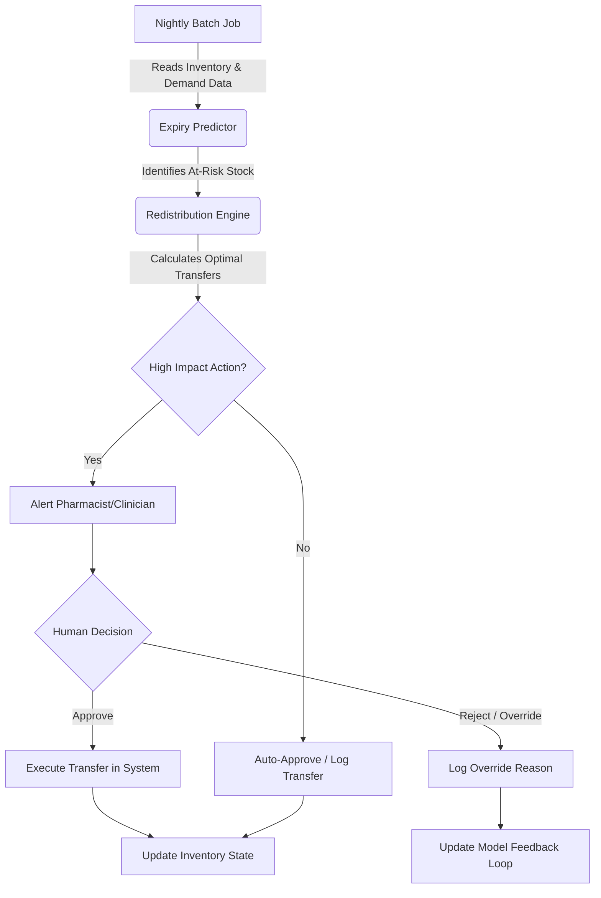

# User and Workflow Map

This document outlines the workflow for the Expiry-Aware Stock Redistribution Recommender, including two distinct patient journeys.

## System Workflow

## Patient Journey 1: Urgent Need (Operating Room)
- **Scenario:** A patient requires an urgent, specialized synthetic medication during surgery.
- **Workflow:**
    1. **Trigger:** The Operating Room (OR) inventory shows a sudden depletion of a critical synthetic medication.
    2. **Recommendation:** The Recommender identifies near-expiry stock of this medication in Ward A (low imminent demand).
    3. **Human Review (High Impact):** Because this involves OR stock, a senior pharmacist receives an urgent alert to approve the transfer from Ward A to the OR.
    4. **Action:** The pharmacist confirms the transfer. The medication is physically moved, arriving in time for the surgery.
    5. **Outcome:** The medication is used before expiry, saving high-value stock and ensuring patient safety.

## Patient Journey 2: Routine Redistribution (Outpatients)
- **Scenario:** Outpatients clinic has steady demand for a standard synthetic medication, but their current stock is far from expiry. Ward B has a batch expiring in 3 days, with zero projected demand.
- **Workflow:**
    1. **Trigger:** The nightly batch job runs.
    2. **Recommendation:** The Recommender suggests transferring the near-expiry batch from Ward B to Outpatients.
    3. **Human Review (Low/Medium Impact):** A pharmacy technician reviews the daily redistribution report. This is standard procedure, so they approve the transfer batch.
    4. **Action:** The stock is transferred during routine morning rounds.
    5. **Outcome:** The near-expiry stock is consumed in Outpatients before expiring, minimizing waste.

## Human Review Points
- **High-Impact Actions:** Transfers involving critical care areas (ICU, OR), high-value medications, or large quantities. These require explicit confirmation from a Pharmacist or authorized Clinician.
- **Override Capture:** If a user rejects a recommendation, they must select a reason (e.g., "Medication recalled," "Ward A actually needs it for an upcoming admission," "Physical stock count mismatch"). This data is crucial for continuous improvement.
